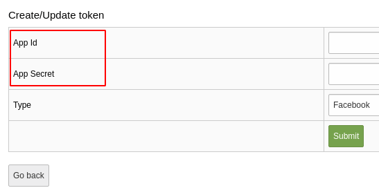
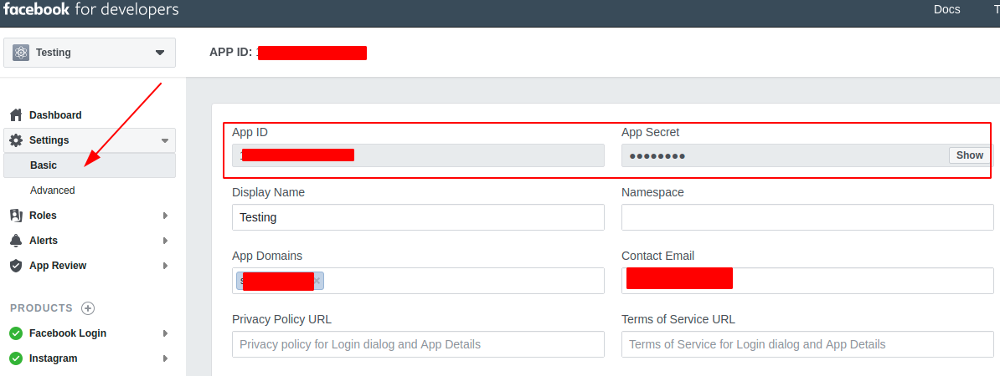
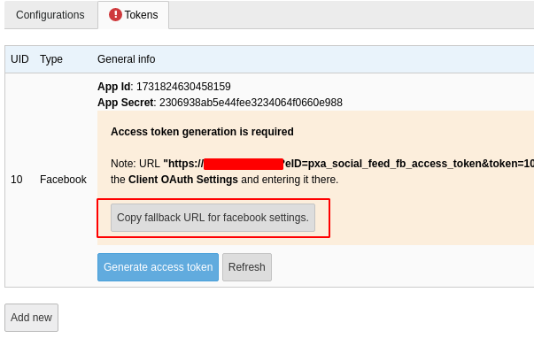
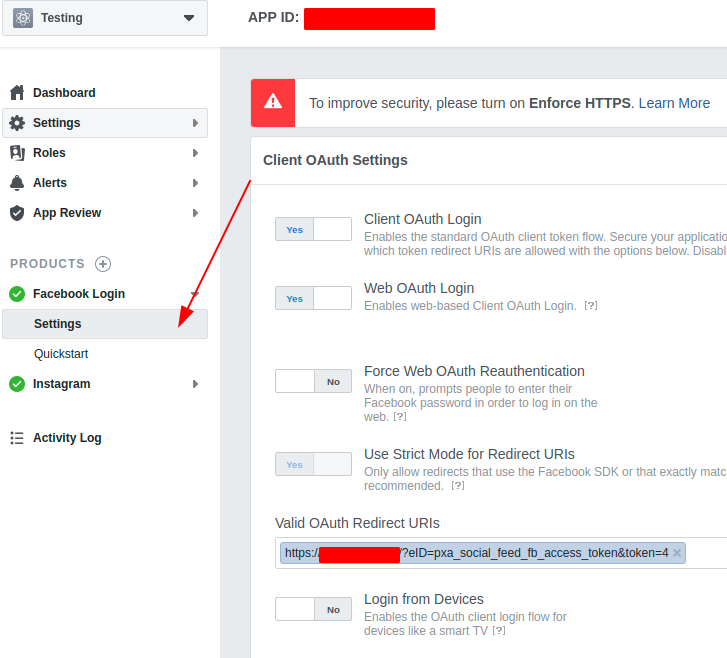
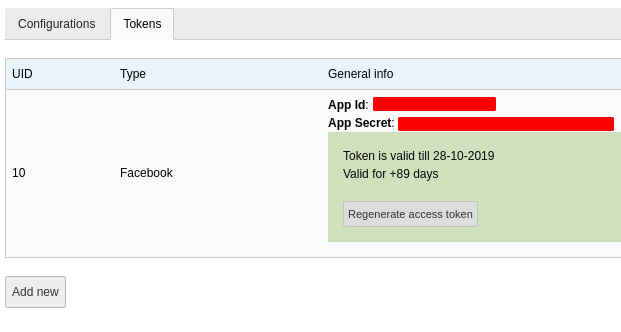
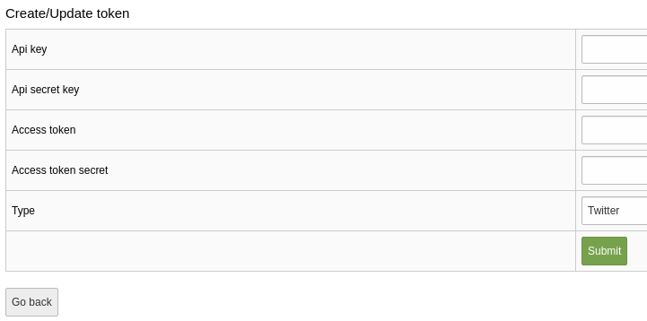
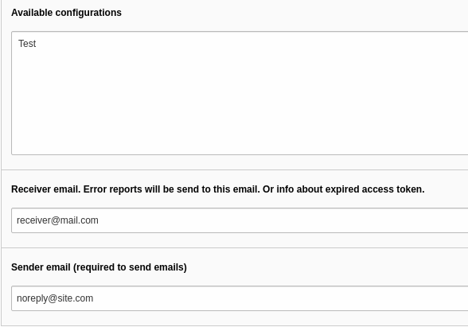

.. include:: ../Includes.txt

.. _configuration:

=============
Configuration
=============

Target group: **Developers, Integrators**

Setup tokens
^^^^^^^^^^^^

**Before creating the configuration, it's required to have an access token.**
To create a new ``Token`` go to the **Social Feed** backend module, switch to the "Tokens" tab and press the "Add new" button.

In the newly opened form, choose the **Type** of token you want to create:

- Facebook
- Instagram
- Twitter
- YouTube

Facebook token
""""""""""""""

You should be logged in to a Facebook account.

.. important::

   The maximum lifetime of a Facebook access token is 3 months. After that it needs to be generated again manually in the BE.

**Before adding the access token** we need to add **App Id** and **App Secret**.

   Facebook token

To get those go to the Facebook Apps page https://developers.facebook.com/apps/ and open your App. If you don't have an app yet, create one.
Copy the ID and Secret from the app settings.

   App Id and Secret

After you've added the ID and Secret, you can generate an access token.

**But first you need to add the redirect url** to the "Valid OAuth Redirect URIs" field found in the "Facebook login" settings in your app.

There is a button called "Copy fallback URL for facebook settings." which will copy the URL to your clipboard that you should then paste into the "Facebook login" app settings.

   Redirect url

   Facebook login

After you've added the redirect URL to the Valid OAuth redirect URIs field on Facebook, **press the "Generate access token"** button. Follow instructions.

**If everything went well you should get an "Access token" that will be saved automatically.**

   Token ready

Instagram token
"""""""""""""""

**Instagram is now using the Facebook graph API.**

The setup process for an Instagram token is the same as for Facebook with the only difference being that you **need to have an Instagram Business account** and a **Facebook page connected to that account**.

Read the documentation section "Before You Start"

`Official documentation <https://developers.facebook.com/docs/instagram-api/getting-started>`_

After you managed to get a Facebook page connected to your Instagram Business account, **follow the same steps as for Facebook token**

Twitter token
"""""""""""""

`Authentication documentation <https://developer.twitter.com/en/docs/basics/authentication/overview>`_

Twitter token requires the following values:

- Api Key
- Api Secret
- Access Token
- Access Token Secret

   Twitter Token

You can find it in your Twitter App settings.
https://developer.twitter.com/en/apps

.. figure:: ../Images/AdministratorManual/TwitterAccess.png
   :class: with-shadow
   :alt: Backend view

   Twitter keys and tokens

YouTube token
"""""""""""""

YouTube token requires only an Api Key.

`Developers documentation <https://developers.google.com/youtube/v3/getting-started>`_

Source Configuration
^^^^^^^^^^^^^^^^^^^^

After token is ready it's possible to create new configuration that will be used by scheduler task to fetch social posts.

Configuration has the following fields:

- Name - just a name, could be anything.
- Social ID (feed source) - social account account ID. It's possible to set it after configuration was saved.
- Maximum items - how many items the scheduler task should fetch at once. **Extension won't store more than this amount of post items in TYPO3**
- Storage - where to save posts.
- Token - what token to use to access social network account.

.. tip::

   For Facebook and Instagram tokens you will be able to choose from what page to fetch posts. For Instagram account you will need to select
   the connected page to that account.

   For Twitter or YouTube you need to enter their accounts IDs.

Scheduler task
^^^^^^^^^^^^^^

After "Configuration" was created you can **create new scheduler task that will use this configuration** to fetch posts from social network.

Optionally you can add **Receiver email** and **Sender email** if you want to get notifications about import errors or **Facebook/Instagram "Access Token" expiry warnings**.

.. important::
    Both receiver and sender should be valid email addresses.

   Scheduler task
